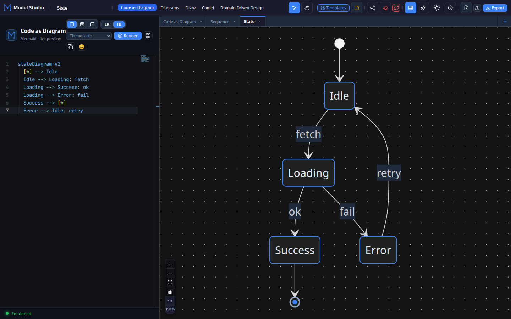
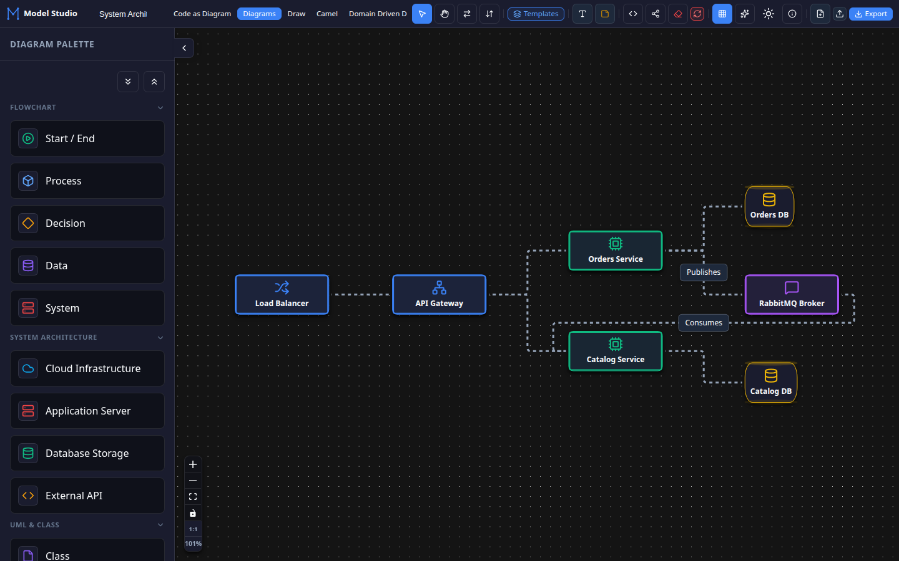
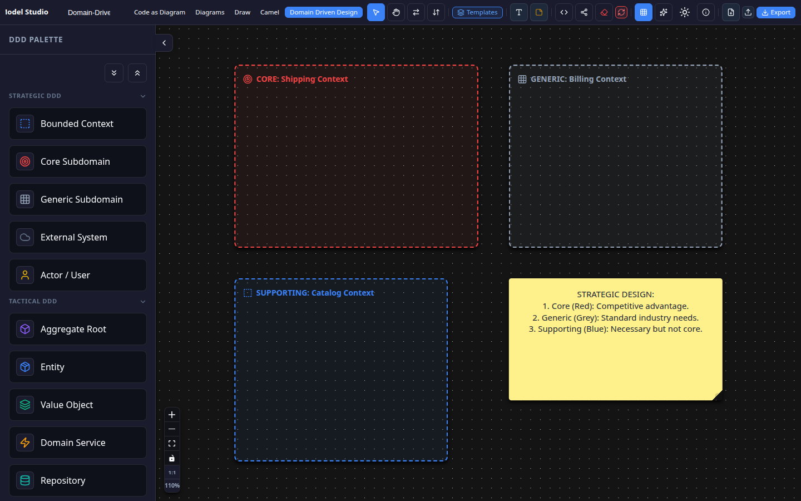
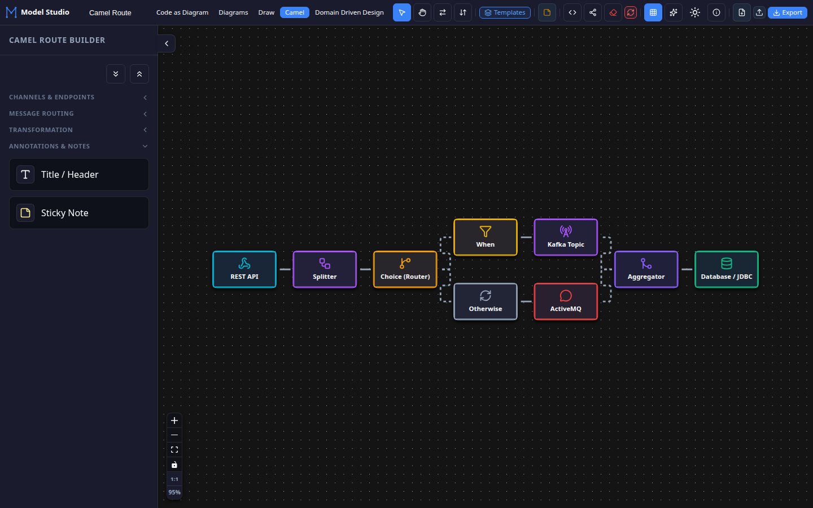
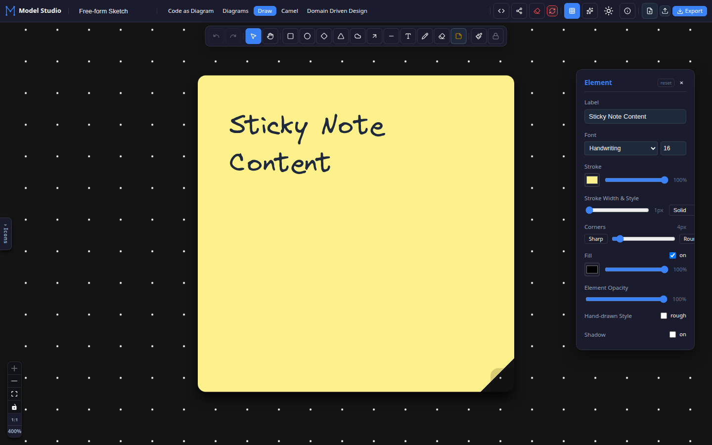

# Model Studio

A professional, local-first browser-based diagramming suite built with React and Vite. Create, edit, and export system architectures, Code as Diagram models, Apache Camel routes, DDD maps, and free-form sketches entirely in your browser. No accounts, no subscriptions, and absolute privacy—your data never leaves your machine.

**Live Application:** [https://geekpratyush.github.io/ModelStudio/](https://geekpratyush.github.io/ModelStudio/)

---

## 📸 Workspace Walkthrough

### 1. Code as Diagram (CAD) with Notepad++ Caching
Write Mermaid code and view instant live previews. Supports 26+ diagram types, custom themes, bracket matching, and error checking.
* **Notepad++ Caching:** Works exactly like Notepad++—all active tabs and code editor states are continuously cached to `localStorage`. Refresh the browser, close the tab, or shut down your PC; your diagrams and tabs persist seamlessly next time you open the app.
* **Multi-Tab Design:** Open multiple diagrams simultaneously, rename tabs by double-clicking them, and initialize new tabs using pre-configured blueprints (Flowcharts, Sequences, C4 Diagrams, Gantt, ERDs, etc.).



### 2. System Architecture & Diagrams
Drag-and-drop system components (servers, databases, load balancers, messaging systems) onto an interactive canvas. Use smart animated connectors and apply LR (Left-to-Right) or TB (Top-to-Bottom) layout engines with a single click.



### 3. Domain-Driven Design (DDD) Modeler
Model Bounded Contexts as container nodes, Aggregates, Entities, Value Objects, and Domain Events. Map context relationships using ACLs (Anti-Corruption Layers), Customer/Supplier links, and Shared Kernels.



### 4. Apache Camel EIP Builder
Visually design integration pipelines using Enterprise Integration Patterns (EIP). Build Timer, Choice, Splitter, Aggregator, and REST endpoint routes, then export a production-ready **Camel YAML DSL** route configuration.



### 5. Free-form Sketch (Whiteboard)
Brainstorm ideas or wireframe layouts using a freehand pencil, custom geometry shapes, resizable sticky notes, and customizable stroke/fill styling. Toggle the hand-drawn **Rough.js** aesthetic for a beautiful, hand-sketched feel.



---

## 🚀 How to Use Model Studio Effectively

To maximize your productivity when using Model Studio, keep these workflows in mind:

### 1. The AI-Enhanced Diagramming Flow
Because the CAD workspace uses Mermaid code:
1. Ask your favorite AI assistant (Gemini, ChatGPT, Claude) to write a diagram for you, e.g.: *"Generate Mermaid C4 container diagram code for a high-availability banking portal with microservices."*
2. Copy the Mermaid code.
3. Paste it directly into the Model Studio editor.
4. Export the resulting high-fidelity graphic immediately or share the layout.

### 2. Local Caching & Security Compliance
Model Studio is **local-first**:
* No server requests are made to save or load diagrams. All data lives in your browser's secure sandboxed storage.
* This makes the tool fully compliant with corporate security guidelines where proprietary application structures cannot be uploaded to third-party cloud servers.

### 3. Seamless Sharing (No Backend Required)
Need to send your diagram to a colleague or add it to documentation?
* Click the **Share** button.
* The application compiles the full diagram state (coordinates, connections, nodes, text) and encodes it as a compressed base64 string inside the URL query parameter.
* Anyone who clicks this link will open your exact diagram in their browser without requiring a database on our side.

---

## 🛠️ Tech Stack & Architecture

- **Frontend core:** [React 19](https://react.dev/) & [Vite 8](https://vitejs.dev/)
- **Node-link engine:** [React Flow / xyflow](https://reactflow.dev/) (provides canvas drag-and-drop, zoom, pan, and handle binding)
- **Mermaid parser:** [Mermaid](https://mermaid.js.org/) (compiles text representations into SVG assets)
- **Code editor:** [Monaco Editor](https://microsoft.github.io/monaco-editor/) (VS Code-grade editing controls)
- **Sketching engine:** [Rough.js](https://roughjs.com/) (hand-drawn geometry stroke styling)

---

## 💻 Local Development

Run the studio locally on your system:

```bash
# Clone the repository
git clone https://github.com/geekpratyush/ModelStudio.git
cd ModelStudio

# Install dependencies
npm install

# Start local development server
npm run dev
```

The app will start at `http://localhost:5173/ModelStudio/`.

---

## 📦 Build & Deployment

To build the static bundle for production hosting:

```bash
npm run build
```

This compiles static HTML/CSS/JS assets to the `dist/` folder, which is hosted on GitHub Pages via a standard GitHub actions workflow `.github/workflows/build.yml` upon push to `main`.

---

## 📄 License

MIT © 2026 Pratyush Ranjan Mishra

